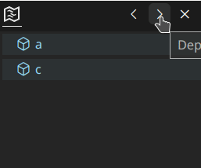

# Change Log

<!-- All notable changes to the "outline-map" extension will be documented in this file.

Check [Keep a Changelog](http://keepachangelog.com/) for recommendations on how to structure this file.-->

### [0.0.1] - 2022-07-14
Initial release

### [0.0.2] - 2022-07-14
Update presentation

### [0.1.1] - 2022-07-15

#### Add

- support for vscode.dev

### [0.1.2] - 2022-07-15

#### Fix 
- resource issue

### [0.2.1] - 2022-07-22

#### Add
- configuration: color customization ~ `outline-map.color`

### [0.3.1] - 2022-07-24

#### Add
- configuration: `outline-map.enableAutomaticIndentReduction`
- configuration: `outline-map.follow`

### [0.4.1] - 2022-07-26

#### Add
- configuration: `outline-map.hiddenItem`

### [0.5.1] - 2022-07-27

#### Add
- configuration: `outline-map.maxDepth`

### [0.5.2] - 2022-07-27

#### Add
- two items in configuration: `outline-map.color` : `visibleRange` and `focusingItem`   Now you can specify the background-color of the outline node when it is in the visible range or the outline node is focused.

#### Fix
- background overlap issue

### [0.5.3] - 2022-07-28

#### Fix
- scrolling issue #7
- The issue that outline probability does not update when switching documents

### [0.6.1] - 2022-07-29

#### Add
- command: `outline-map.addDepth` & `outline-map.reduceDepth`
- view action: `<` & `>` for max depth adjustment.  When you scroll / focus on the area whose depth is greater than the set depth, the outline node will not be displayed. 
- command: `outline-map.pin` & `outline-map.unpin` ~ issue #8
- view action: `📌`

#### Other
- minimized the size of the extension package(.vsix)
  - removed unnecessary image in the extension package(.vsix)
  - minimized the size of webview file 

### [0.7.1] - 2022-07-29

#### Add
- configuration: `outline-map.expandOutlineMethod`
- click the icon to expand the outline node ~ issue #11

### [0.7.2] - 2022-07-30

#### Add
- Now the max depth will display when you change the max depth (using `<` & `>`) ~ issue #13
- command: `outline-map.freeze`: same as the original `outline-map.pin`

#### Modify
- command `outline-map.pin`: now the outline will scroll automatically to follow the cursor/viewport