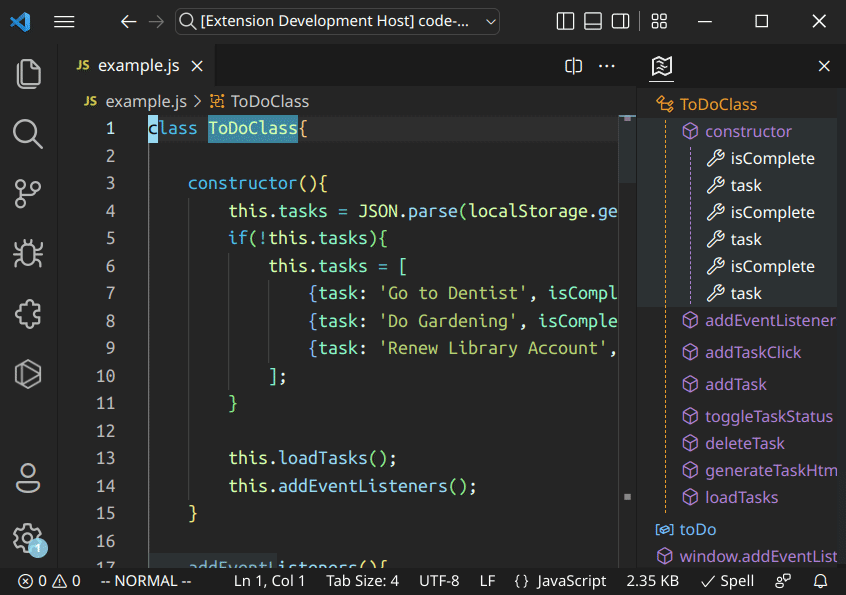
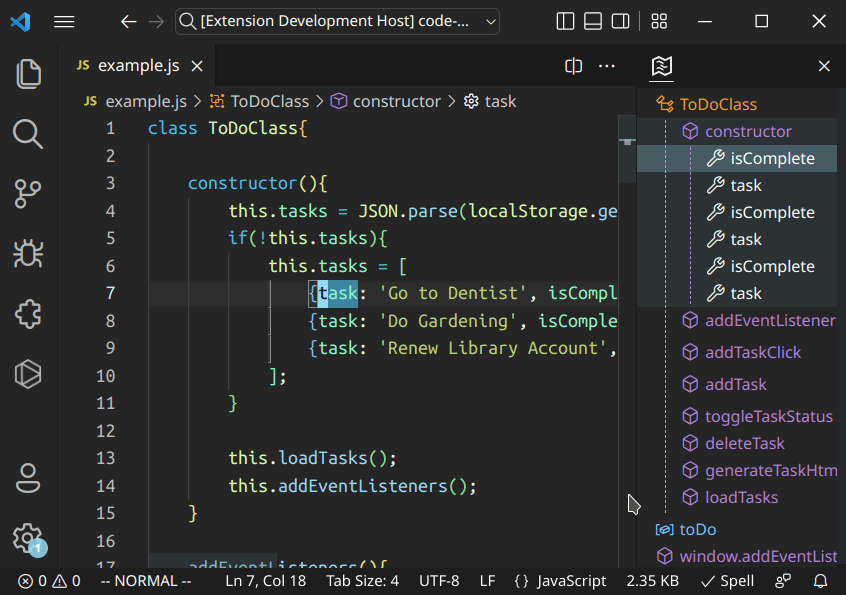
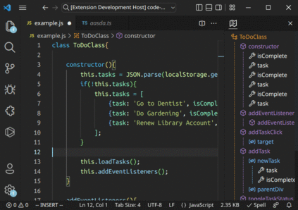
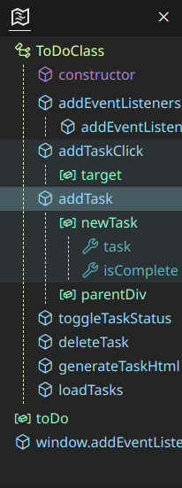
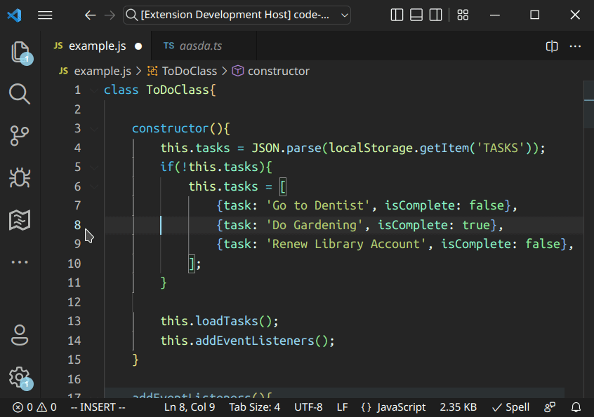

# Outline Map

A visual, interactive outline map. Alternative Minimap.

## Features

- ### Follow the cursor

- ### Quick navigation

- ### Flag diagnostics

- ### Color customization

---

## Set the view container position

---

## Configuration
- `outline-map.color`: color table for specific symbols

**Enjoy!**
