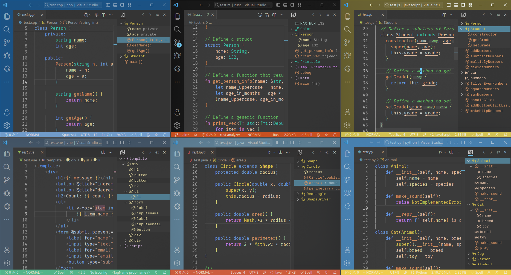

# Outline Map

EN | [中文](README_ZH_CN.md)



A visual, interactive outline map that combines the clarity of the outline with the intuitive overview of the minimap. Enhanced version of vscode built-in outline.


## Features

### Follow

Automatically scroll, expand and collapse the outline tree when the cursor moves or the viewport scrolls.


### Navigation

You can navigate to the symbol by clicking on the outline node like the built-in outline.

Keyboard navigation is also supported.


### Diagnostics

Show diagnostics of the current file.


### Search

default keybinding: `<Alt-l>`

Search for symbols in the current file. You can use the following syntax to achieve different search effects:

- `/<exp>`: Normal search
- `=<exp>`: Regex
- `?<exp>`: Fuzzy search

You can append `@` to filter by symbol kind before the search expression.


### Region and tag

Supports region and tag syntax

You can define regions to group code symbols anywhere in the code (usually comments), or tags to mark locations.

#### Grammar 

```md
#region <name> <comment>
#tag <name> <comment>
#endregion <name>
```

#### Features
- Allows customizing identifiers for regions and labels.
- Tag syntax highlighting (semantic highlighting needs to be enabled)
- Region folding


### Workspace symbols

You can display symbols of multiple files in the workspace, such as regions, tags, functions, etc., and quickly jump to the corresponding location.

After enabling this feature, the symbols of newly opened files will be automatically added to the list. You can manage the symbols in the list in the following ways:

- Set an interval to automatically remove inactive files from the list
- Manually close the symbols of files that are not needed, exclude a specific symbol, or exclude symbols that match a pattern
- Sort the list by last access time to find the symbols of the recently used files

By default, region and tag symbols will be added. You can customize the symbols to be added by modifying the `outline-map.IncludeSymbols` setting.

---

## Configuration

### Customization

- `outline-map.customFont`: Custom font for the outline. 
    
    Syntax: `[ <family-name> | <generic-family> ]#`
  
- `outline-map.customCSS`: Custom css for the outline. The css will be injected into the outline's webview.

- You can customize the color of the outline by `workbench.colorCustomizations`. Outline Map uses the symbol color settings built into vscode, i.e. `symbolsIcon.*Foreground`, and you can also set the color for the two symbols added by the extension and some UI elements:
  - `symbolIcon.om_TagForeground` - The color of the tag symbol
  - `symbolIcon.om_RegionForeground` - The color of the region symbol
  - `outline-map.visibleRangeBackground` - The background color of the visible area in the outline view
  - `outline-map.focusingItemBackground` - The  background color of the focusing item in the outline view
  - `outline-map.focusingItemForeground` - The foreground color of the focusing item in the outline view

### Behavior

- `outline-map.follow`: Scroll the outline when the cursor moves or the viewport scrolls

- `outline-map.expand`: Set the automatic expansion mode of the outline view. Select `cursor` to expand only to the node where the cursor is located, and `viewport` to expand all nodes in the viewport.

- `outline-map.hiddenItem`: Choose items you do not want to see in the outline.

- `outline-map.defaultMaxDepth`: Set the default maximum depth of the outline tree. Set this to non-zero to enable the depth button `>` & `<`.

- `outline-map.findRef.enabled`: Enable references to be displayed when clicking to jump.

- `outline-map.findRef.useFindImpl`: Display implements instead of references.

### Region and tag

- `outline-map.region.enabled`: Enable region and tag support
  
- `outline-map.region.startRegion`: The start of a region.

- `outline-map.region.endRegion`: The end of a region.

- `outline-map.region.tag`: The start of a tag.

- `outline-map.region.highlight`: Enable region and tag syntax highlighting

## Commands


<!-- - `outline-map.focusSearch`: 聚焦搜索框, 默认键位 `<Alt-l>`
- `outline-map.toggleSearch`: 切换搜索及导航区域可见性.

### 视图操作

- 深度限制: 增加 / 减少大纲的一级. `outline-map.defaultMaxDepth` 为正值时可用.
  - `增加深度 >`
  - `减少深度 <`

- 临时固定
  -	`固定`: 大纲节点将不会自动展开;
  - `冻结`: 大纲节点将不会自动展开, 同时大纲视图不会自动滚动;

- 排序
  - `按位置排序`: 按位置排序大纲节点;
  - `按名称排序`: 按名称排序大纲节点;
  - `按类型排序`: 按类型排序大纲节点; -->
  
- `outline-map.focusSearch`: Focus the search box, default keybinding `<Alt-l>`
- `outline-map.toggleSearch`: Toggle the visibility of the search and navigation area.

### View Actions

- Depth limit: Increase / decrease the outline by one level. Available when `outline-map.defaultMaxDepth` is a positive value.
  - `Increase depth >`
  - `Decrease depth <`

- Temporarily fix
  - `Fixed`: The outline node will not be automatically expanded;
  - `Frozen`: The outline node will not be automatically expanded, and the outline view will not automatically scroll;

- Sort
  - `Sort by position`: Sort the outline nodes by position;
  - `Sort by name`: Sort the outline nodes by name;
  - `Sort by kind`: Sort the outline nodes by kind;

---

Suggestion: move view to secondary side panel (vscode ^1.64)

> Outline Map does not perform language-specific symbol parsing, symbol information is provided by vscode or other extensions.
> 
>  Refer to the following links for more information: [vscode-code-outline/  language-support](https://github.com/patrys/vscode-code-outline#language-support)

---

**Enjoy! ❤️**
