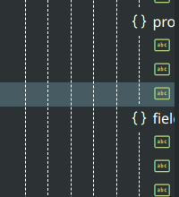
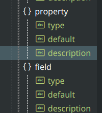
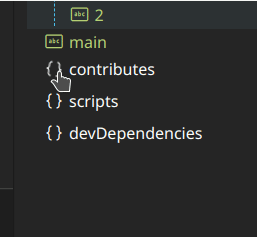

# Outline Map

[EN](README.md) | 中文

可视, 可互动的大纲地图, 提供大纲的清晰条理与缩略地图的直观概览. 

## 特性

- ### 跟随光标

- ### 快速导航

- ### 标记诊断

- ### 自定义颜色主题

---

## 设置
更改将在重启大纲视图后生效
- `outline-map.color`: 为特定符号设置颜色
- `outline-map.enableAutomaticIndentReduction`: 当父节点超出视图范围时减少子节点的缩进  -> 
- `outline-map.follow`: 设置大纲视图自动跟随光标|视口
	- `viewport`: 当滚动代码时, 编辑器可视区域的中间节点会被滚动至大纲视图中心, 自动展开/折叠大纲;
	- `cursor` (默认): 当光标移动时, 光标所在的节点会被滚动至大纲视图中心, 自动展开/折叠大纲;
  - `cursor-always-open`: 跟随光标, 手动展开/折叠大纲
- `outline-map.hiddenItem`: 选择隐藏大纲视图中的节k
- `outline-map.defaultMaxDepth`: 设置默认最大深度.  将其设置为正值以启用命令按钮 `>` & `<`.
- `outline-map.expandOutlineMethod`: 设置大纲视图展开方式
  - `click` (默认): 点击图标展开 
  
  - `hover`: 鼠标悬停时展开;
- `outline-map.customFont`: 设置自定义字体. 例: `Consolas, "Courier New", monospace`
- `outline-map.customCSS`: 设置自定义CSS. 使用 `帮助->切换开发人员工具` 来查看元素的类名. 如果某些规则不起作用, 可以加上`!important`.

## 命令
- `outline-map.addDepth` | `outline-map.reduceDepth`: 增加 / 减少大纲的一级. `outline-map.defaultMaxDepth` 为正值时可用.
- `outline-map.pin` | `outline-map.unpin`: 固定 / 取消固定 / 冻结大纲视图.
  - `unpin`: 取消固定大纲视图;
  - `pin`: 大纲节点将不会自动展开;
  - `freeze`: 大纲节点将不会自动展开, 同时大纲视图不会自动滚动;

---

## 建议: 将视图移至辅助侧栏 (vscode ^1.64)

---

> Outline Map 依赖于 vscode 或 其他扩展提供符号信息

> 出现**个别类型文件**大纲无法显示/显示错误的情况请检查内置大纲是否支持该语言
> - **否**：请寻找相关扩展提供正确符号信息
> - **是**：提交[issue](https://github.com/Gerrnperl/outline-map/issues), 附带问题文件和安装的相关扩展。

> 参考: [vscode-code-outline/language-support](https://github.com/patrys/vscode-code-outline#language-support)
---

**Enjoy!**
