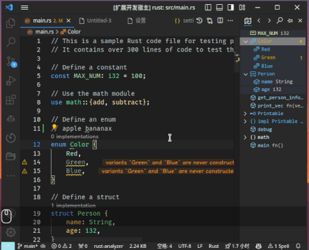

# Outline Map

[EN](README.md) | 中文


可视, 可互动的大纲地图, 提供大纲的清晰条理与缩略地图的直观概览. 更好的 VSCode 内置大纲.


## 特性

### 跟随

根据代码视图或光标位置自动滚动, 展开与折叠大纲。


### 导航

点击大纲节点可跳转至对应位置, 也支持键盘导航。


### 诊断

显示当前文件的错误与警告。


### 搜索

默认键位: `<Alt-l>`

在当前文件中搜索符号. 可以使用以下语法实现不同的搜索效果:

- `/<exp>`: 正常搜索
- `=<exp>`: 正则表达式
- `?<exp>`: 模糊搜索

在搜索前输入 `@` 以按符号类型过滤
  


### 区域与标签

支持区域与标签语法

可以在代码中的任何位置定义区域以分组代码符号(通常是注释), 或者定义标签以标记位置.

#### 语法

```md
#region <name> <comment>
#tag <name> <comment>
#endregion <name>
```

#### 功能

- 可折叠或展开区域
- 标签和区域语法高亮
- 自定义区域与标签的标识符


### 工作区符号

可以在一个列表中显示工作区中多个文件的符号，例如区域、标签、函数等，并且可以快速跳转到相应的位置。

启用这个功能后，新打开的文件的符号会自动添加到列表中。可以通过以下方式管理列表中的符号：

- 设置一个时间间隔，自动从列表中移除不活跃的文件

- 手动关闭不需要的文件的符号，排除某个特定的符号或排除匹配某个模式的符号

- 按照最后访问的时间来排序列表，方便找到最近使用的文件的符号

默认情况下会添加区域和标签符号。可以通过修改 `outline-map.IncludeSymbols` 的设置来自定义需要添加的符号。


## 设置

### 样式

- `outline-map.customFont`: 设置自定义字体. 
  
  语法: `[ <family-name> | <generic-family> ]#`

- `outline-map.customCSS`: 设置自定义CSS. 这些CSS会被插入大纲的Webview视图

- 可以通过`workbench.colorCustomizations`自定义大纲的颜色，Outline Map沿用vscode内置的符号颜色设置，即`symbolsIcon.*Foreground`，此外还可为扩展添加的两个符号以及一些UI元素设置颜色：
  - `symbolIcon.om_TagForeground` - 标签符号的颜色
  - `symbolIcon.om_RegionForeground` - 区域符号的颜色
  - `outline-map.visibleRangeBackground` - 大纲视图中可见区域的背景色
  - `outline-map.focusingItemBackground` - 大纲视图中聚焦项目的背景色
  - `outline-map.focusingItemForeground` - 大纲视图中聚焦项目的前景色

### 行为

- `outline-map.follow`: 设置大纲视图自动跟随光标|视口滚动

- `outline-map.expand`: 设置大纲视图自动展开模式，选择`cursor`时只展开到光标所在的节点，选择`viewport`时展开视口内的所有节点

- `outline-map.hiddenItem`: 选择隐藏大纲视图中的项目
  
- `outline-map.defaultMaxDepth`: 设置默认最大深度.  将其设置为正值以启用命令按钮 `>` & `<`.

- `outline-map.findRef.enabled`: 启用点击跳转时同时显示references

- `outline-map.findRef.useFindImpl`: 显示implement而不是reference

### 区域与标签

- `outline-map.region.enabled`: 启用区域与标签功能

- `outline-map.region.startRegion`: 区域的开始标识符

- `outline-map.region.endRegion`: 区域的结束标识符

- `outline-map.region.tag`: 标签的标识符

- `outline-map.region.highlight`: 启用区域与标签的语法高亮


## 命令

- `outline-map.focusSearch`: 聚焦搜索框, 默认键位 `<Alt-l>`
- `outline-map.toggleSearch`: 切换搜索及导航区域可见性.

### 视图操作

- 深度限制: 增加 / 减少大纲的一级. `outline-map.defaultMaxDepth` 为正值时可用.
  - `增加深度 >`
  - `减少深度 <`

- 临时固定
  -	`固定`: 大纲节点将不会自动展开;
  - `冻结`: 大纲节点将不会自动展开, 同时大纲视图不会自动滚动;

- 排序
  - `按位置排序`: 按位置排序大纲节点;
  - `按名称排序`: 按名称排序大纲节点;
  - `按类型排序`: 按类型排序大纲节点;

---

建议: 将视图移至辅助侧栏 (vscode ^1.64)

> Outline Map 不会进行语言相关的符号解析, 符号信息由 vscode 或其他扩展提供.
>
> 参考: [vscode-code-outline/language-support](https://github.com/patrys/vscode-code-outline#language-support)
---

**Enjoy! ❤️**
